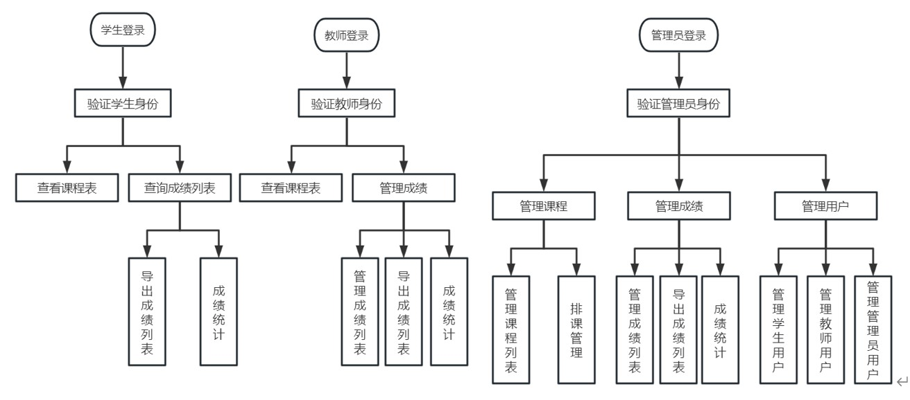
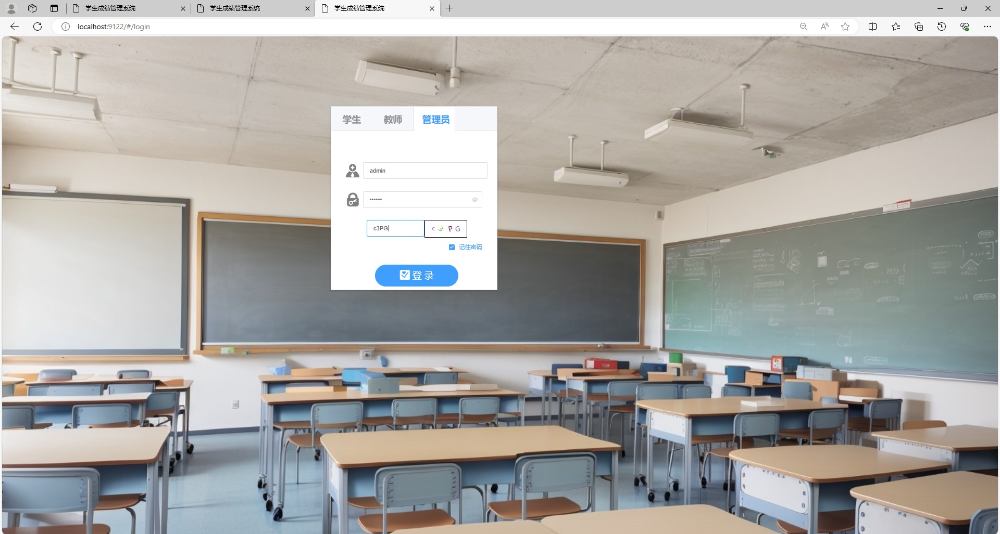
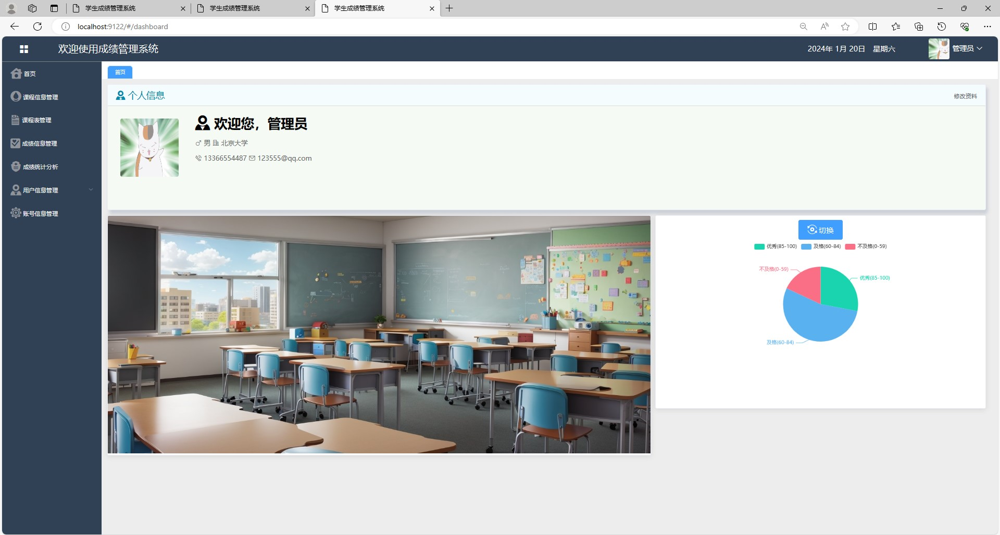
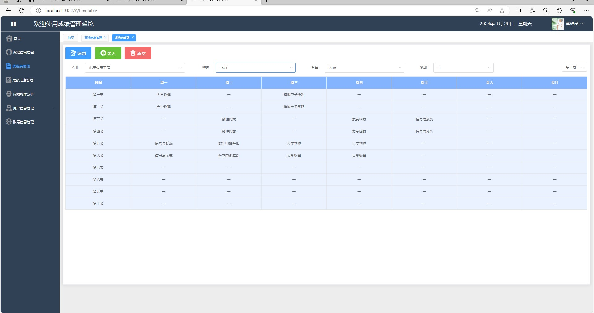
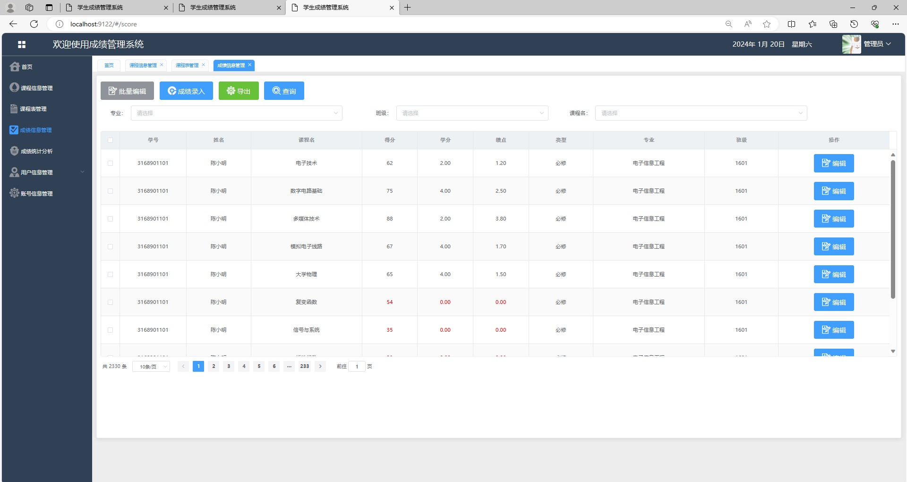
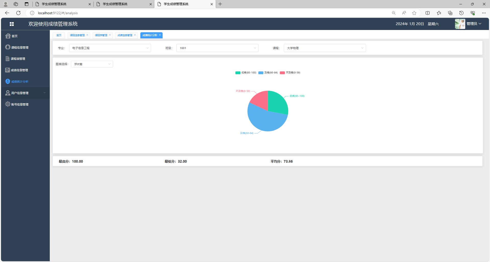
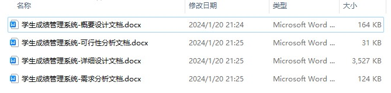
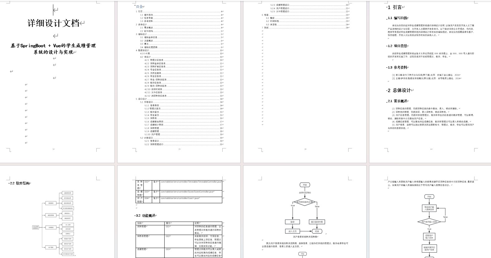

# 学生成绩管理系统

### 9.9￥ 获取完整源码+sql，附赠11000字论文参考，需要的加Q：3808981644 微信：qszard26
### 有问题，或者需要协助调试运行项目的也可联系
### 获取更多项目，关注公众号：编程项目集

## 一、介绍

基于springboot+vue的前后端分离学生成绩管理系统

开发语言：java

运行环境:idea或eclipse vscode 数据库:mysql

前端技术：Vue、ELementUI、echarts

后端技术：SpringBoot、Mybatis-Plus

角色：管理员、老师、学生

(1) 管理员：登录、个人信息编辑、课程信息管理（课程新增、删除、编辑）、课程表管理（课程编辑、录入）、绩信息管理（成绩录入、编辑、导出、查询）、成绩统计分析、用户信息管理（三个用户的新增、删除、编辑）

(2) 教师：登录、首页、个人信息编辑、课程表管理、成绩信息管理（成绩录入、编辑、导出、查询）、成绩统计分析

(3) 学生：登录、首页、个人信息编辑、课程表管理、成绩信息管理、成绩统计分离

## 二、部分页面截图展示

## 三、11000字论文参考

### 9.9￥ 获取完整源码+sql，附赠11000字论文参考，需要的加Q：3808981644 微信：qszard26
### 有问题，或者需要协助调试运行项目的也可联系

